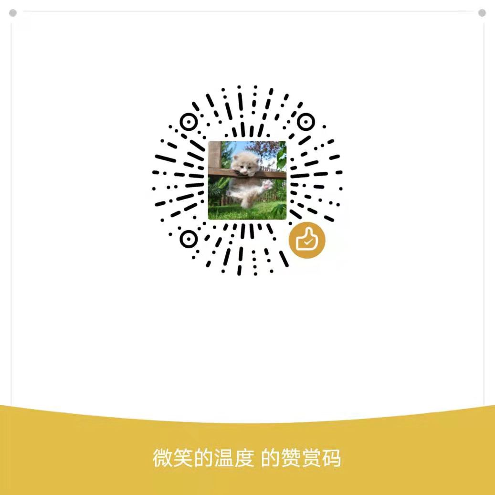

![[docker] CI for releases](https://github.com/LogicJake/WebMonitor/workflows/%5Bdocker%5D%20CI%20for%20releases/badge.svg?branch=master&event=push)

[中文文档](https://www.logicjake.xyz/WebMonitor) | [English Document](https://www.logicjake.xyz/WebMonitor/#/en/) | [Telegram Group](https://t.me/webmonitor_github)

## 特性
* 支持requests请求网页，支持使用PhantomJS抓取异步加载的网页
* 支持 xpath 和 css selector 选择器，支持 JsonPath 提取 json 数据
* 支持邮件，pushover，微信提醒（support by server酱），Bark推送以及自定义GET/POST通知
* 简洁的UI，可视化操作
* 支持自定义请求头，抓取需要登录的网页
* 支持设置监控规则
* 监控RSS更新
* 数据导入导出

## Buy Me a Coffee

