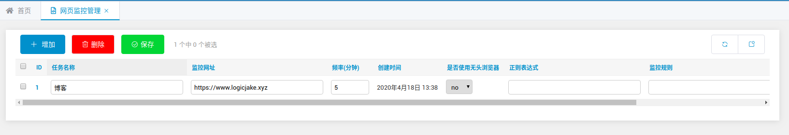
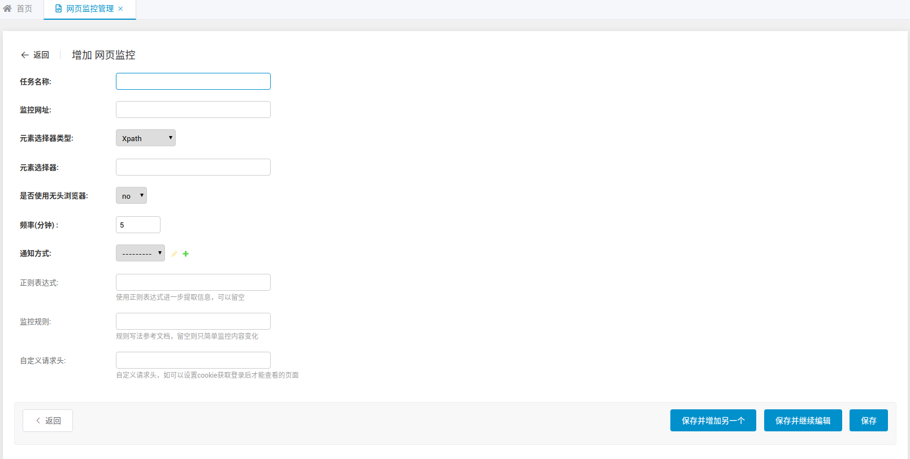
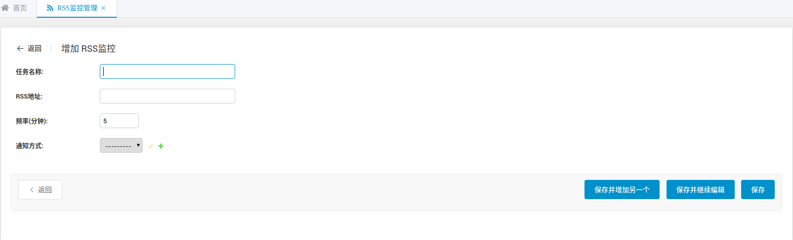
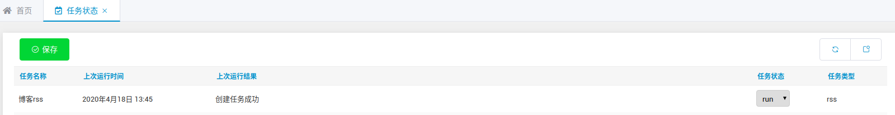

## 设置通知方式  
支持五种通知方式：邮件，pushover， Server 酱的微信提醒，Bark以及自定义POST通知。邮件提醒只需要设置接收邮箱，微信提醒需要申请 SCKEY，自行搜索 Server 酱注册，简单免费。Pushover 需要填写注册就得到的 User Key。Bark需要安装[客户端](https://github.com/Finb/Bark)取得对应设备Key。  

### 设置系统邮箱
如果采用邮件提醒，则必须设置系统邮箱，该邮箱为提醒邮件的发信人。自行根据需要使用的邮箱查找相关设置，密码一般指授权码。

系统邮箱配置只需设置一个，多于一个默认只生效第一条。

### 设置 Pushover Application
如果采用 Pushover 提醒，则必须设置 Pushover api token。

### 设置自定义POST通知
如果采用自定义通知，则必须设置 自定义网址。用`{header}`和`{content}`替换掉标题和内容的位置。以Bark为例，格式如下：  
```
https://api.day.app/yourkey/{header}/{content}
```
若自定义通知没有标题位置就把`{header}`和`{content}`都放在内容位置，不能缺失。

## 添加网页监控任务
在 任务管理 > 网页监控管理 添加新任务  

* 必须选择一种通知方式  
* 默认抓取频率为5分钟，自行根据需要调整，单位分钟，不建议调太快，以防反爬  

  
  

### 选择器
元素选择器类型可以选择 Xpath， Css selector 或 JsonPath，可以借助浏览器 F12 直接 copy 前两种选择器，需要注意的是，往往浏览器 copy 得到是元素，而不是文本信息，需要做以下补充：  

#### xpath
* 获取元素文本信息，在浏览器得到的选择器后加```/text()```，如  
```//*[@id="id3"]/h3``` => ```//*[@id="id3"]/h3/text()```

* 获取元素属性信息，在浏览器得到的选择器后加```/@属性名```，如想获取元素href值  
```//*[@id="id3"]/h3``` => ```//*[@id="id3"]/h3/@href```

* 获取元素及其子元素的所有文本信息，在浏览器得到的选择器后加```/string()```，如  
```//*[@id="id3"]/h3``` => ```//*[@id="id3"]/h3/string()```

#### css selector
* 获取元素文本信息，在浏览器得到的选择器后加```::text```，如  
```div#id3 > h3``` => ```div#id3 > h3::text```

* 获取元素属性信息，在浏览器得到的选择器后加```::attr(属性名)```，如想获取元素href值  
```div#id3 > h3``` => ```div#id3 > h3::attr(href)```

#### JsonPath
针对返回 json 数据的接口, 可以使用 JsonPath 提取数据, 具体教程参考 https://goessner.net/articles/JsonPath/

### 是否选择无头浏览器
如果源网页没有异步加载，可以不使用无头浏览器获取网页
```
建议先选择不使用，假如提交时提示获取不到文本信息，再使用无头浏览器尝试
```

### 正则表达式
如果获取到的文本信息有冗余，可以采用正则进一步筛选，如  
```价格：1390```使用正则```([1-9]\d*)```提取到纯数字1390

### 监控规则
默认不填则文本发生变化就发通知，多规则请以';'分开。存在规则的情况下，如果文本发生变化，从前往后检查规则，若符合其中一项规则就发通知。  
规则格式：-规则 参数  
支持以下规则：

#### -contain
如：文本发生变化且文本内容包含```上架```
```
-contain 上架
```

#### -increase
如：文本发生变化且相较于旧值，数值增长超过```3```  
```如果文本内容不是纯数字，请用正则提取出纯数字，否则将会报错```
```
-increase 3
```

#### -decrease
如：文本发生变化且相较于旧值，数值减少超过```3```  
```如果文本内容不是纯数字，请用正则提取出纯数字，否则将会报错```
```
-decrease 3
```

#### -equal
如：文本发生变化且等于某个值，数值等于```3```  
```如果文本内容不是纯数字，请用正则提取出纯数字，否则将会报错```
```
-equal 3
```

#### -less
如：文本发生变化且小于某个值，数值小于```3```  
```如果文本内容不是纯数字，请用正则提取出纯数字，否则将会报错```
```
-less 3
```

#### -more
如：文本发生变化且大于某个值，数值大于```3```  
```如果文本内容不是纯数字，请用正则提取出纯数字，否则将会报错```
```
-more 3
```

### 自定义请求头
可以自定义请求时的请求头，主要用于设置Cookie，获取需要登录才能查看的页面，格式为字典，如  
```{'Cookie':'自定义cookie值'}```

## 添加RSS监控任务
可以在 任务管理 > RSS监控任务管理 添加新RSS监控任务  

    



## 任务状态查看
可以在任务状态栏目下查看所有任务，包括任务状态（run or stop），上次运行时间，上次运行结果，运行结果包括三类：  

* 监测到变化，最新值：{最新值}  
* 成功执行但未监测到变化  
* 出错显示异常信息  

  

可以通过修改任务状态，暂停或重启任务  

## 数据导入导出
***WARNING: 网页监控任务和RSS监控任务的通知方式是通过外键与通知方式表连接，在数据表发生变化的情况下，外键id可能失效或无法和导出时保持一致，建议每次导入任务数据后检查通知方式是否正常。***